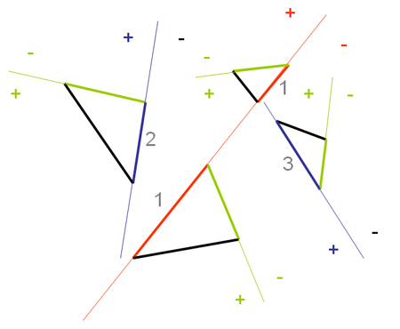

# Transparent Polygon Rendering and Frustum Culling Using Binary Space Partitioning (BSP) Tree

## Overview

<p align="center">
  
</p>

This work demonstrates absolute back-to-front rendering order of transparent polygons, with Z-buffer turned off, and frustum culling using BSP tree. The first part describes partitioning of a geometrical scene into a BSP tree and the second describes how the tree goes to be traversed focusing on correct rendering order and frustum culling.

In drawing primitives made up of transparent polygons, the rendering order is crucial for accurate visual effects. The problem with using the standard hardware Z-buffer is that it fails when pixels with a greater depth value are compared to existing pixels with a smaller depth value. This implementation applies BSP (Binary Space Partitioning) trees to solve this problem.

## Creating BSP Tree

In Figure 1.1, there are four polygons. In splitting this configuration, we choose the most balanced face(s) of the polygons to form a splitting plane and store the face(s) in a BSP node. "1" represents two coplanar triangles, the thinner red line is the splitting plane formed by them. The first node contains two faces. The red plane is a well-balanced plane (five faces on both sides). Next, we find two balanced planes from both sides of the red plane: "2" in the red "+" side and "3" in the red "-" side. Recursively, we have four green splitting planes and four face leafs in black.

<p align="center">
  <br>
  *Figure 1.1: One non-coplanar face (black) in each leaf for strict back-to-front rendering.*
</p>

If strict ordering is not required, there can be more than one non-coplanar face per leaf, and the green splitting planes will not be treated, as shown in Figure 1.2. This approach can speed up the partitioning process and improve efficiency of the viewing frustum traversing the tree, because of significant decreases in node and leaf numbers.


*Figure 1.2: More than one non-coplanar face (black) in each leaf for coarser rendering order.*

For the implementation, all faces in the scene are initially stored in a linked-list, with N nodes for N faces in it. For each node, there is a pointer to its parent node and two pointers to its child nodes, as shown in Figure 1.3. Thus, it forms a hierarchy of binary tree.


*Figure 1.3: Initial linked-list before partitioning.*

A recursive partitioning function is designed to build all branches of the BSP tree. Refer to Figure 1.4, a specified node \( s \) (a face splitter, its pointer as the input for the recursive partitioning function) and uses its splitting plane to partition all faces in the same hierarchical level (faces with the same parent) throughout the linked-list. 


*Figure 1.4: Nodes (red and blue) with the same parent.*

If they intersect, \( s \) splits it into three faces, including its UV texture coordinates, and updates the linked-list by adding two more nodes and modifying the original node from a larger face on the left to a smaller face on the right, as shown in Figures 1.5 and 1.6.


*Figure 1.5: Division of a single triangle into three triangles.*


*Figure 1.6: Two inserted nodes (with stars) and the modified node (with diamond).*

After \( s \) node partitions all nodes in the same hierarchical level, a balanced node from a pool of children nodes of \( s \) on both sides will be selected for the next level of partitioning. Recursively, a binary tree is formed, each branch has only one parent and two children, and each leaf has one parent but may consist of more than one face, depending on the strictness of rendering order.

### Recursive Partitioning Function

```cpp
// Recursive function to partition nodes in same hierarchical level with splitter node pointed by input pointer "node".
void BuildBranches(BSP_Node *node) {
    BSP_Node *temp, *target = NULL, *pos_target = NULL, *neg_target = NULL;
    // Split all other nodes in same level and set them to be children of this node.
    temp = headnode;
    while (temp != NULL) {
        if (temp->side == node->side && temp->Parent == node->Parent && temp != node) {
            temp->Parent = node;
            // This is function to split "temp" using splitting plane in "node".
            // It divides face in "temp" into three faces and also interpolates their UV texture coordinates.
            UpdateLink(node, temp);
        }
        temp = temp->LinkTo;
    }
    // Find balanced nodes (next splitting plane) on both sides of this node.
    pos_target = FindBalanceNode(0, node);
    neg_target = FindBalanceNode(1, node);
    // If balanced node on "0" side is found, set it to be child of this node.
    if (pos_target != NULL) {
        node->Pos_Child = pos_target;
        node->IsPosChecked = true;
    }
    // If balanced node on "1" side is found, set it to be child of this node.
    if (neg_target != NULL) {
        node->Neg_Child = neg_target;
        node->IsNegChecked = true;
    }
    // If no children, then quit this recursive function.
    if (node->Pos_Child == NULL && node->Neg_Child == NULL)
        return;
    // Continue recursive function for "0" side of this node.
    if (node->Pos_Child != NULL)
        BuildBranches(node->Pos_Child);
    // Continue recursive function for "1" side of this node.
    if (node->Neg_Child != NULL)
        BuildBranches(node->Neg_Child);
}
```

## Traversing BSP Tree

After a BSP Tree is constructed, it can be traversed in various manners. Here, we describe back-to-front traversing. The idea is simple: it involves spatial detection between partitioning planes and the viewing frustum. 


*Figure 1.7: Traversing BSP tree.*

### Recursive Traversing Function

```cpp
// Recursive function for drawing faces in BSP tree in back-to-front order.
void DrawNode(BSP_Node *node) {
    float var;
    if (node->IsLeaf) {
        // Draw this triangle in node.
        SetMaterial(node);
        m_pd3dDevice->DrawPrimitive(D3DPT_TRIANGLELIST, node->nVB, 1);
        DrawCoplanars(node);
        DrawLeaf(node);
        node_count++;
        return;
    }
    // Check for viewing frustum with current partitioning plane.
    float w[5];
    var = node->v[0].x * node->normal.x + node->v[0].y * node->normal.y + node->v[0].z * node->normal.z;
    w[0] = (vf.ViewPoint * node->normal) - var;
    w[1] = (vf.LowerLeft * node->normal) - var;
    w[2] = (vf.LowerRight * node->normal) - var;
    w[3] = (vf.UpperLeft * node->normal) - var;
    w[4] = (vf.UpperRight * node->normal) - var;
    if (w[0] < 0.0f && w[1] < 0.0f && w[2] < 0.0f && w[3] < 0.0f && w[4] < 0.0f) {
        // All are at negative side.
        if (node->Neg_Child != NULL)
            DrawNode(node->Neg_Child);
        else {
            // Draw this triangle in node.
            SetMaterial(node);
            m_pd3dDevice->DrawPrimitive(D3DPT_TRIANGLELIST, node->nVB, 1);
            DrawCoplanars(node);
            node_count++;
            return;
        }
    } else {
        if (w[0] >= 0.0f && w[1] >= 0.0f && w[2] >= 0.0f && w[3] >= 0.0f && w[4] >= 0.0f) {
            // All are at positive side.
            if (node->Pos_Child != NULL)
                DrawNode(node->Pos_Child);
            else {
                // Draw this triangle in node.
                SetMaterial(node);
                m_pd3dDevice->DrawPrimitive(D3DPT_TRIANGLELIST, node->nVB, 1);
                DrawCoplanars(node);
                node_count++;
                return;
            }
        } else {
            // Further consider this node.
            // Frustum is intersecting with node's plane, so consider both sides.
            var = (Walker.lin_r * node->normal) - (node->v[0].x * node->normal.x + node->v[0].y * node->normal.y + node->v[0].z * node->normal.z);
            if (var < 0.0f) {
                // On negative side.
                // Draw opposite side, positive.
                if (node->Pos_Child != NULL)
                    DrawNode(node->Pos_Child);
            } else {
                // On positive side even var = 0
                //Draw this side, positive.
                if (node Pos_Child != NULL)
                	DrawNode(node->Pos_Child);
            }
        }
    }
}
```